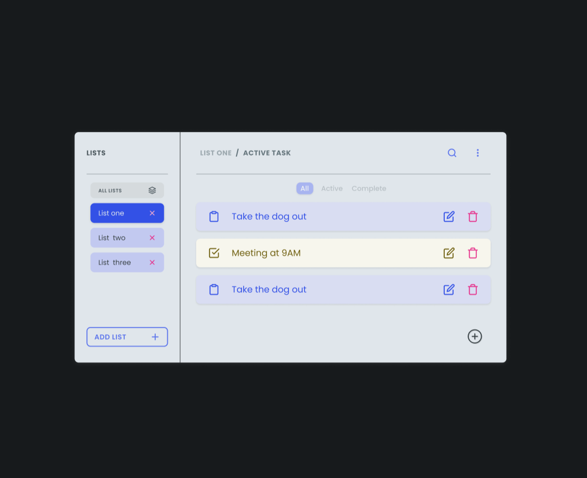

<p align="center">
  <a href="https://www.adazolhub.online">
    
    <h1 align="center">Adazolhub </h1>
  </a>
</p>
<p align="center">
    <h3 align="center"> Task Manager </h3>
</p>



### Debugging

First, run the development server:

 Run the local server at localhost:3000

```bash

$ npm run start
# or
$ yarn start

```
Run sass watcher

```bash
$ sass --watch src/scss:src/css
```

----

### Contributors

Daniel Lozada